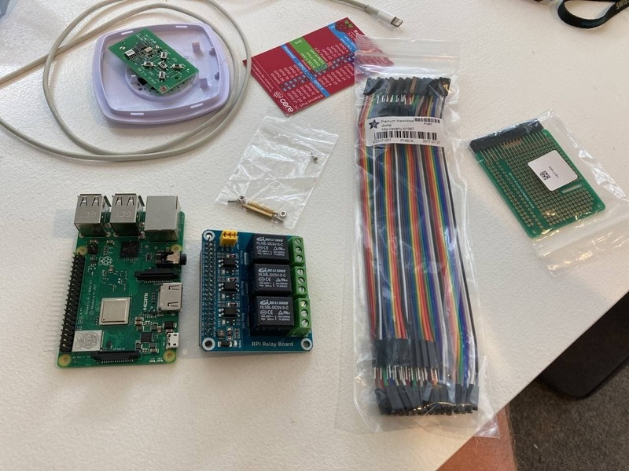

I made my first solder joint in about 15 years to achieve *Smort* control of my garage door using a Raspberry Pi 4, relay hat, and a spare remote.

<!--more-->

Repository: https://github.com/jason-s13r/garage-door

- Pi 3b+ I had lying around.
- Garage door remote.
- Relay hat.
- Breakout board.
- Some wires.

Intention is to make a 'hat' using the breakout board. This powers the remote from the Pi.

I bought a soldering iron and accessories.

Those don't look too bad for something I haven't done since high school.

<video src="./05-works.mp4" width="100%" controls="controls"></video>

First test cycling the relays with it connected to the remote. It works!

<video src="./06-telegram.mp4" width="100%" controls="controls"></video>

Toggling the door is now just a `/toggle` command for a telegram bot. I can then use the camera stream from my Reolink PTZ-423 to show me the door going up or down.  
No need to add a sensor on the door to figure out whether it's open if I can just take a photo.

Hey, that kinda looks like what I had planned.