When I came across the T-Deck, I thought it could be a fun device to give to my child instead of a phone so she can navigate Whangārei and still be in contact with us.

I didn't expect that I would [fork a C++ project](https://github.com/jason-s13r/MCLite) to extend the firmware to my liking.

<!--more-->

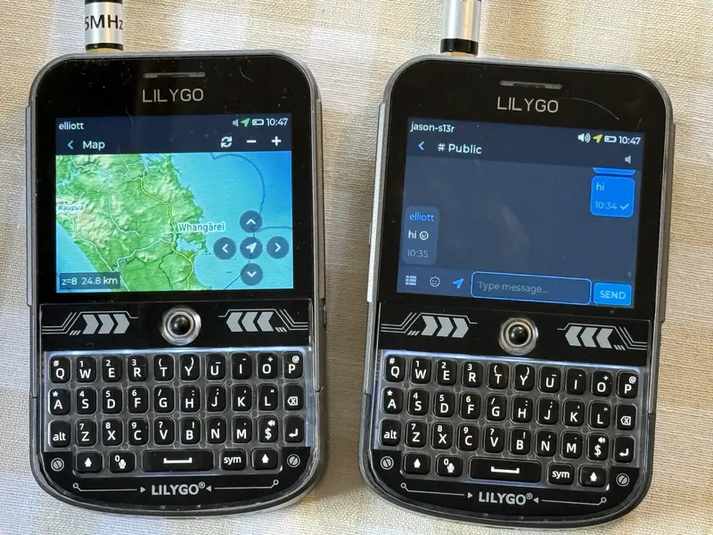

I discovered the T-Deck from a [Jeff Geerling](https://www.youtube.com/watch?v=2Ry-ck0fhfw) video about Meshtastic. I was _mostly_ satisfied with the Meshtastic firmware, but found it not simple & intuitive enough to give to a child. However, almost all other firmware options that I could find were _worse_.

## MCLite

I came across the [Awesome MeshCore](https://github.com/samuk/awesome-meshcore) list of projects, and discovered [MCLite](https://github.com/laserir/MCLite) for T-Deck. I used the config tool and flashed the firmware onto my devices. I was pleasantly surprised by how simple it was to operate and how nice it looked; the blue theme looked like it was inspired by Telegram in dark mode.

On boot, it immediately shows the list of conversations. I can request telemetry and location information about the other device, and see that location on a map. All configuration is from a JSON file, with a secret device info screen that shows it.

## Almost Perfect

There were four things that I wanted to change:

1. Tap on a message sender's name to insert a _reply_ prefix of `@[name] ` into the message text field.
1. Mute a specific chat, and not the entire device.
1. Support rendering of emoji in messages and node names.
1. A map of my own location, that isn't dependent on opening a contact's location.

And so, I forked the project, cloned & opened up VS Code. One problem: I don't know C++.  
But an AI coding agent does. So I opened Copilot, using a Kimi K2.6 model via Ollama.

## AI Coding

At first I thought it would be filled with frustration: most of my agentic coding experience has been with languages and frameworks that I know well enough to have an opinion about the approach and expected code.  
But with this, I know next to nothing about C++, the structure of this project, or the libraries in use, or anything about making firmware for an ESP32-based device.

I was free: unable to challenge the code output and blissfully ignorant about its quality. If it compiles & builds, can be flashed, and my testing shows it working as I want: it may not be good, but it's good enough.

And so I asked for, and got what I wanted:

    <figure>
        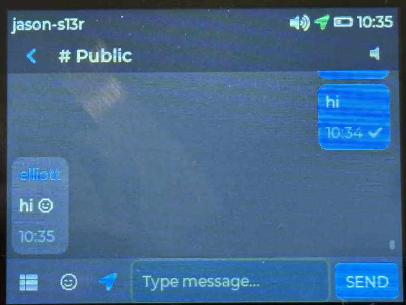
        <figcaption>Chat messages with support for rendering emojis.</figcaption>
    </figure>
    <figure>
        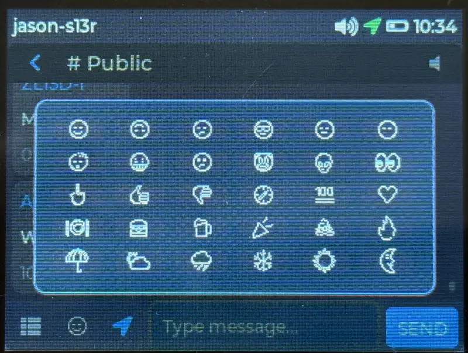
        <figcaption>Choose from 30 emojis on an <em>emoji keyboard</em> to use in messages.</figcaption>
    </figure>
    <figure>
        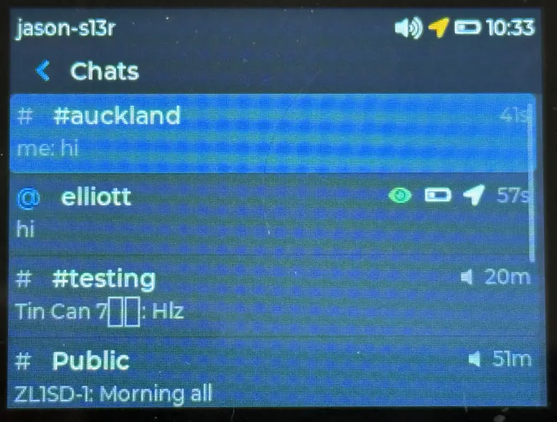
        <figcaption>Chats can be muted by long pressing the chat.</figcaption>
    </figure>
    <figure>
        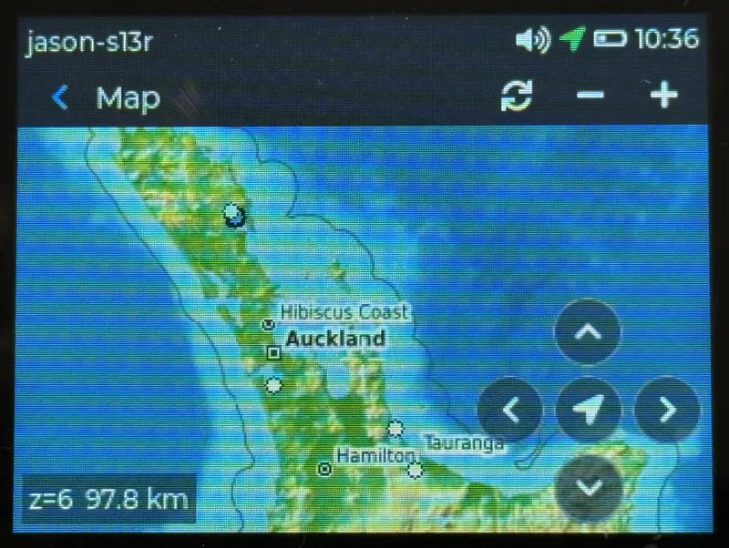
        <figcaption>A standalone map view for my own location.</figcaption>
    </figure>

### I Kept Going

After refactoring the map to be standalone, I wanted to see where a specific heard advert was from. I also wanted, for my own T-Deck at least, to be able to publicise an imprecise location when my device sends a heard advert.

And on-device configuration of settings _required_ extracting the configurable sections from the Device Info screen to their own screens.

    <figure>
        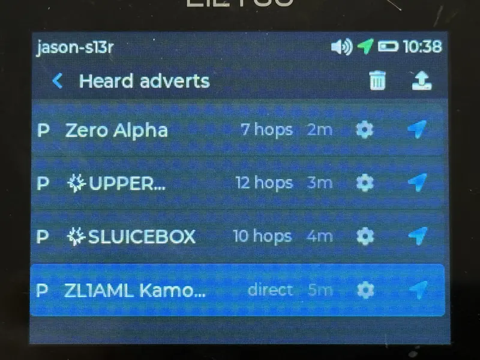
        <figcaption>Heard node adverts with a button to the map view.</figcaption>
    </figure>
    <figure>
        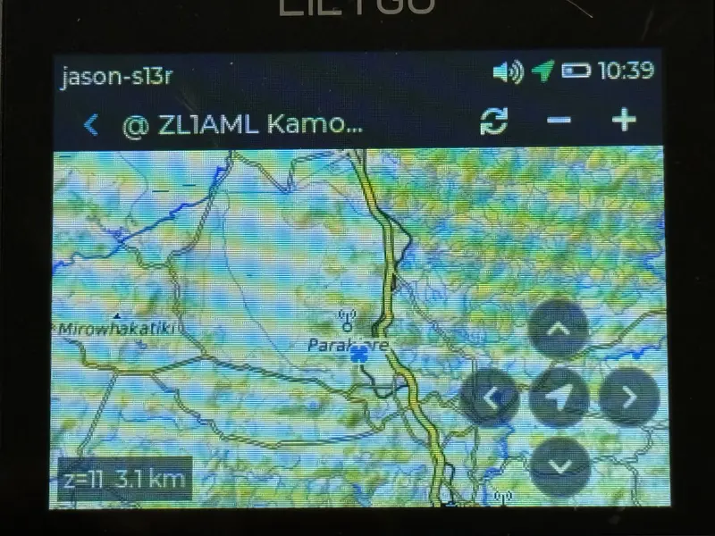
        <figcaption>Map showing a repeater node's claimed location.</figcaption>
    </figure>
    <figure>
        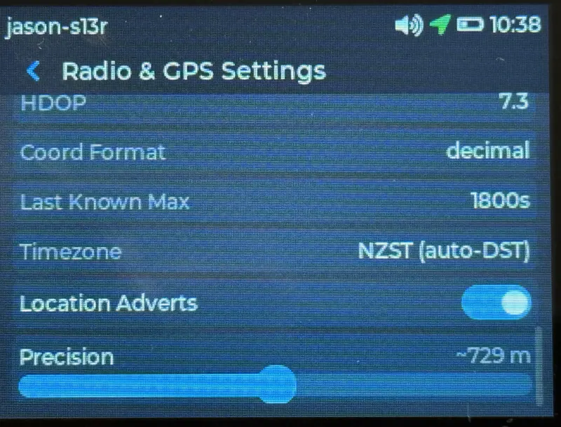
        <figcaption>Toggle switch to enable sending location-aware heard adverts at some precision.</figcaption>
    </figure>
    <figure>
        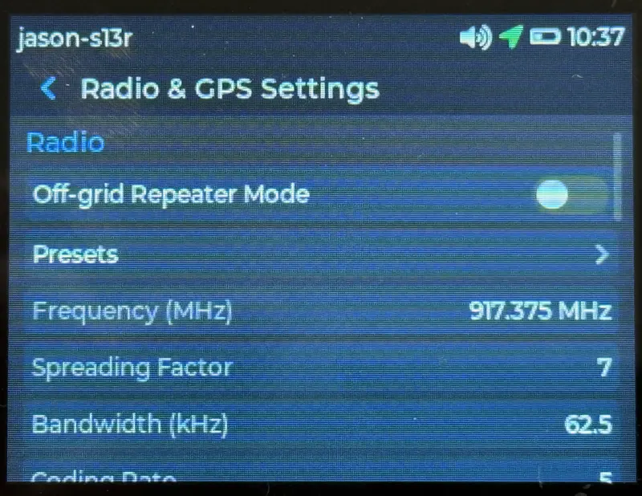
        <figcaption>On-device editability of MeshCore radio settings, with presets.</figcaption>
    </figure>
    <figure>
        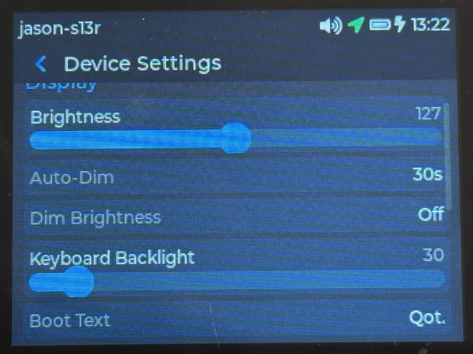
        <figcaption>Sliders to adjust screen & keyboard backlight brightness.</figcaption>
    </figure>
    <figure>
        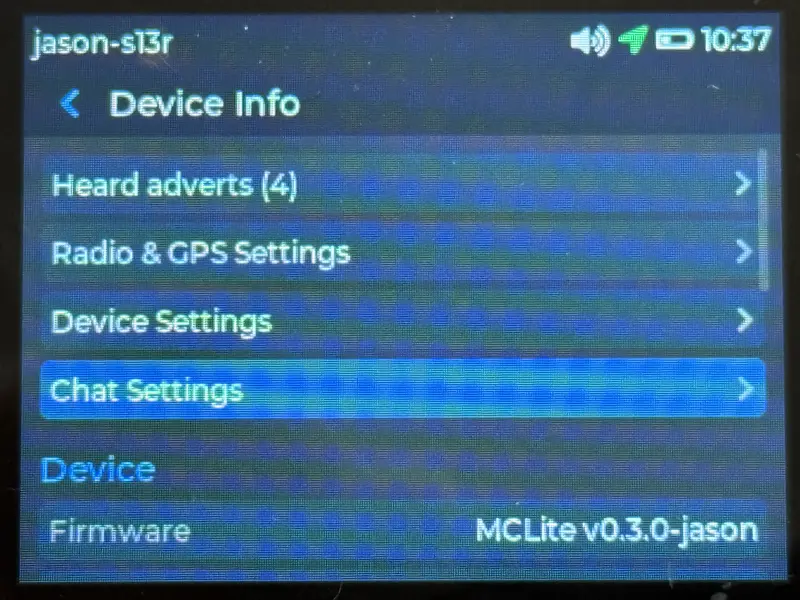
        <figcaption>Buttons on the device info screen to access the on-device configurable settings.</figcaption>
    </figure>

